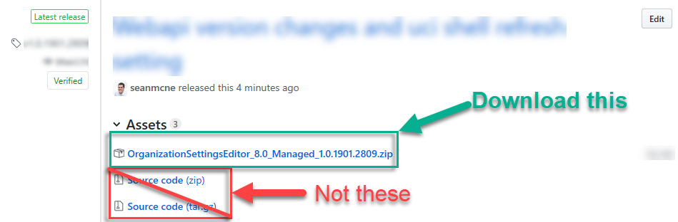
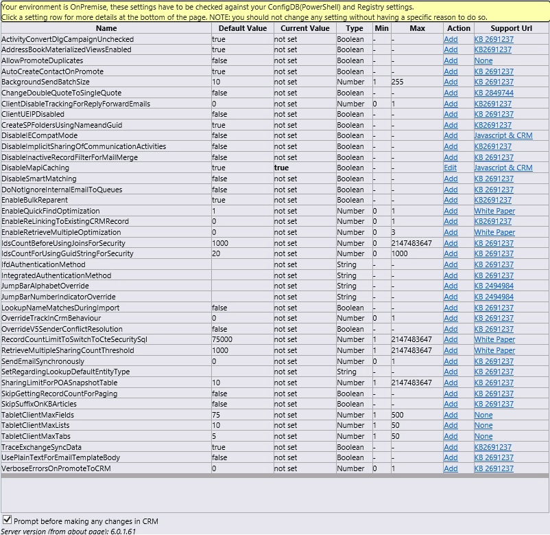

### Project Description
This is a utility allowing admins of Dataverse (PowerPlatform and D365) including Dynamics 365 Sales, Service, FS, PS apps, as well as all Model apps.

This utility allows you to edit your settings without the use of the command line utility in the KB article documenting "OrgDBOrgSettings."  The utility is written using the Dataverse SDK for guidance and all read/write operations for the OrgDbOrgSettings utilize the Dataverse OData endpoint.  The utility is provided as a managed solution & webresources which can easily be installed and uninstalled from your Dataverse environment.  

### Where to find the releases?
The link to the releases is somewhat hidden in plain sight - to help with this, you can just click this link to get to the releases page: https://github.com/seanmcne/OrgDbOrgSettings/releases 

### How do I download & install just the latest released solution from GitHub?
- Go to the releases page https://github.com/seanmcne/OrgDbOrgSettings/releases 
- Download the zip release - *do not download the source, make sure to download the solution zip file* 

- Once you download the zip file upload this solution into your Dataverse environment by navigating to Settings | Solutions then click the Import button in the command bar. You can also install via the maker portal make.powerapps.com, go to *Solutions*, then import this solution. 
- Once completed you now can use the editor to alter any settings that need to be changed or viewed

### Where to I find it after installing?
The OrgDBSettings utility is installed as a managed Dataverse solution. This utility utilizes the Solution Configuration Page to provide access to the editor.  To find the editor: 
- log into the **Maker Portal** for your environment and geography (US customers would utilize make.powerapps.com)
- navigate to **Solutions**, then **click** to open the **Organization Settings Editor** managed solution
- within the managed solution **Click** the **Switch to Classic** button in the top toolbar of the maker portal (typically it's under the ellipsis or "..." near the "Publish All Customizations" button).  
- When you click **Switch to Classic** your browser will open a new page to the classic solution editor
- Once that page renders you should see the orgdborgsettings Editor page as pictured below

_**Why isn't there a dedicated App, Sitemap page, or ribbon button?** In early testing I received feedback asking for the utility to have it's own place in the sitemap however, after discussing with partners, developers, and ISV's they asked to remain out of apps, sitemaps, and the ribbon due to potential dependency conflicts._

Browser Supportability: 
- CRM/Dataverse v9.0 and higher in Edge (Chromium), Edge, Chrome, Firefox, and Safari on Mac.
- NOTE: Some browser configurations block XDR's (cross domain requests) and thus will not get the benefit of update warnings - if you're impacted by this you can disable any addins that block these requests, alternatively keep checking back on this site for updates. 
- If you must use IE, please use another browser such as Edge https://aka.ms/GetEdge - for folks who are stuck with IE talk to your IT Department about using modern browsers, if you are absolutely stuck you can read this article on [CRM Disable IE Compatibility Mode](CRM-Disable-IE-Compatibility-Mode) *however*, I'm not planning on making changes to accommodate Internet Explorer (IE) at this point in time. 

The importing of this managed solution will include the following components: 
- JQuery [http://jquery.com/](http://jquery.com/)
- JSON2 [http://www.json.org/](http://www.json.org/)
- OrgDBOrgSettings.html [How to use the editor](How-to-use-the-editor.md)
- settings.xml [What is Settings.xml](What-is-Settings.xml.md)
- Azure Mobile Apps [Azure Portal](http://portal.azure.com), MSDN [AzureMobile Services](https://azure.microsoft.com/en-us/services/app-service/mobile/) - this service is used for the browser to call back and check for any new updates of the editor solution (and prompt you to download an update, if one is available). 

### What about On-Prem CRM?
OnPrem Editions are supported for editting organization database settings otherwise known as OrgDBOrgSettings as well as some selected Organization attributes, please understand that onprem may or may not have the same settings - _mileage may vary_ for onprem and you'll want to be sure your version of onprem contains the setting you want to change. 
